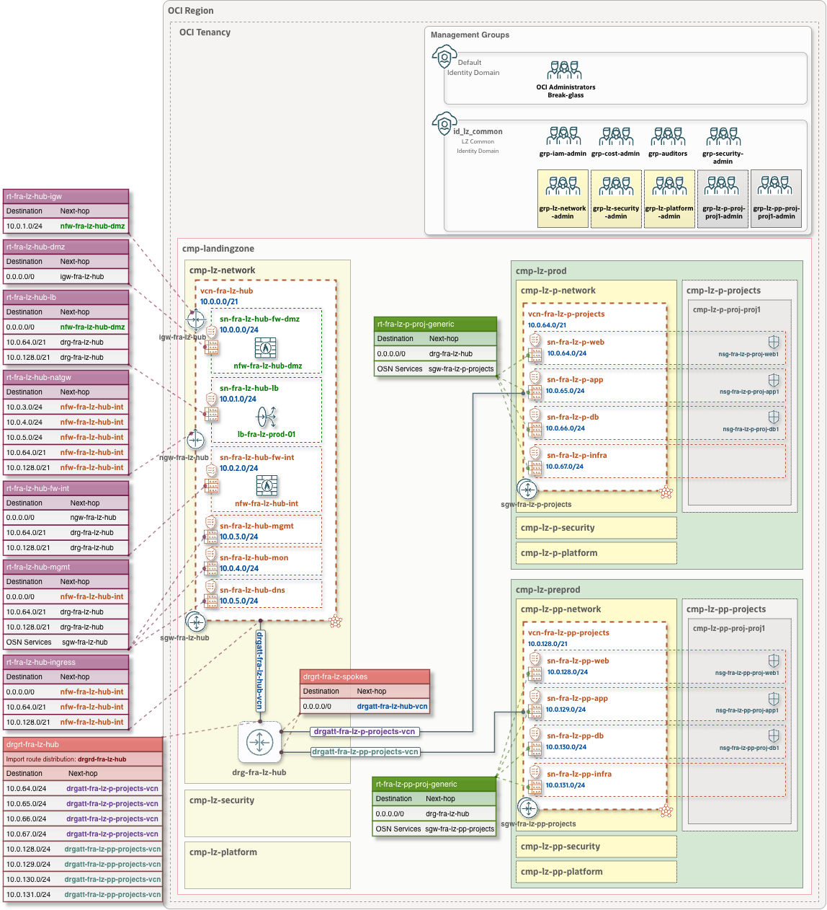

 
 # **One-OE + Hub A: One-Stack Deployment**
 
 ### Overview
 This document provides a detailed overview of the One-OE Landing Zone with Hub A addon, including its components and deployment guidance.

&nbsp; 

 ### Deployment Diagram
 

&nbsp; 

 ### Input Configurations

| JSON configuration | Configuration-defined components | Terraform module | 
|:-|:-|:-|
| [**IAM Configuration**](oci_open_lz_one-oe_iam.auto.tfvars.json) | Compartments, Identity Domain, IAM groups, policies | [OCI Landing Zone IAM](https://github.com/oci-landing-zones/terraform-oci-modules-iam) |
| [**Network Configuration**](oci_open_lz_hub_a_network_light.auto.tfvars.json) | Hub A, two OCI Network Firewalls (DMZ, Internal), Internet GW, NAT GW, Service GW, DRG, Routing tables, two Spoke VCNs (Prod, PreProd), Security Lists, NSGs| [OCI Landing Zone Network](https://github.com/oci-landing-zones/terraform-oci-modules-networking) |
| [**Security Configuration**](oci_open_lz_one-oe_security_cisl1.auto.tfvars.json) | Security Zones, Cloud Guard | [OCI Landing Zone Security](https://github.com/oci-landing-zones/terraform-oci-modules-security) |
| [**Observability Configuration**](oci_open_lz_one-oe_observability_cisl1.auto.tfvars.json) | Events, Alarms, Logging, and Notifications | [OCI Landing Zone Observability](https://github.com/oci-landing-zones/terraform-oci-modules-observability) |

&nbsp; 

 
### Deplyment
|| One-Stack Deployment with CIS Level 1  Security Controls | One-Stack Deployment with CIS Level 2  Security Controls | 
|---|---|---|
| **Use** | This option is recommended in scenarios where:  • CIS Level 1 Security Controls meet your security requirements.  • You are exploring or testing configurations and need to deploy and tear down environments quickly.  • You are creating a proof-of-concept (PoC) environment.   | This option is recommended in scenarios  where:  • Your security requirements mandate  CIS Level 2 Security Controls (for example,  using Vault to manage encryption keys and  enforcing encryption of data in block storage, object storage, and other OCI services). |
| **Deploy with ORM**   *• Step #1*|  [](https://cloud.oracle.com/resourcemanager/stacks/create?zipUrl=https://github.com/oci-landing-zones/terraform-oci-modules-orchestrator/archive/refs/tags/v2.0.5.zip&zipUrlVariables={"input_config_files_urls":"https://raw.githubusercontent.com/oci-landing-zones/oci-landing-zone-operating-entities/master/blueprints/one-oe/runtime/one-stack/oci_open_lz_one-oe_iam.auto.tfvars.json,https://raw.githubusercontent.com/oci-landing-zones/oci-landing-zone-operating-entities/master/blueprints/one-oe/runtime/one-stack/oci_open_lz_hub_a_network_light.auto.tfvars.json,https://raw.githubusercontent.com/oci-landing-zones/oci-landing-zone-operating-entities/master/blueprints/one-oe/runtime/one-stack/oci_open_lz_one-oe_observability_cisl1.auto.tfvars.json,https://raw.githubusercontent.com/oci-landing-zones/oci-landing-zone-operating-entities/master/blueprints/one-oe/runtime/one-stack/oci_open_lz_one-oe_security_cisl1.auto.tfvars.json,https://raw.githubusercontent.com/oci-landing-zones/oci-landing-zone-operating-entities/master/blueprints/one-oe/runtime/one-stack/oci_open_lz_one-oe_governance.auto.tfvars.json"})  And follow these steps: 1. Accept terms, wait for the configuration to load.  2. Set the working directory to “rms-facade”.  3. Set the stack name you prefer. 4. Set the terraform version to 1.5.x. Click Next.  5. Accept the default files. Click Next. Optionally, replace with your json/yaml config files.  6. Un-check run apply. Click Create.     | [](https://cloud.oracle.com/resourcemanager/stacks/create?zipUrl=https://github.com/oci-landing-zones/terraform-oci-modules-orchestrator/archive/refs/tags/v2.0.5.zip&zipUrlVariables={"input_config_files_urls":"https://raw.githubusercontent.com/oci-landing-zones/oci-landing-zone-operating-entities/master/blueprints/one-oe/runtime/one-stack/oci_open_lz_one-oe_iam.auto.tfvars.json,https://raw.githubusercontent.com/oci-landing-zones/oci-landing-zone-operating-entities/master/blueprints/one-oe/runtime/one-stack/oci_open_lz_hub_a_network_light.auto.tfvars.json,https://raw.githubusercontent.com/oci-landing-zones/oci-landing-zone-operating-entities/master/blueprints/one-oe/runtime/one-stack/oci_open_lz_one-oe_observability_cisl1.auto.tfvars.json,https://raw.githubusercontent.com/oci-landing-zones/oci-landing-zone-operating-entities/master/blueprints/one-oe/runtime/one-stack/oci_open_lz_one-oe_security_cisl1.auto.tfvars.json,https://raw.githubusercontent.com/oci-landing-zones/oci-landing-zone-operating-entities/master/blueprints/one-oe/runtime/one-stack/oci_open_lz_one-oe_governance.auto.tfvars.json"})  And follow these steps: 1. Accept terms, wait for the configuration to load.  2. Set the working directory to “rms-facade”.  3. Set the stack name you prefer. 4. Set the terraform version to 1.5.x. Click Next.  5. Accept the default files. Click Next. Optionally, replace with your json/yaml config files.  6. Un-check run apply. Click Create. |
| **Post deployment**   *• Step #2*|This is an **optional** step to be executed once Step 1 Stack and all landing zone elements are created. This step requires the **update the previous ORM stack json configuration files** in order to complete the Networking routing, add extra Security Zones Recipes (3, 4, and 5), and Network Flow Logs. This update can be executed in one step by replacing both files as described below.  **Network routing**:  Optionally, you can **deploy a "dummy VM" as a firewall** and complete the **routing** with the following steps:   **a**. Deploy a dummy FW VM for the DMZ and Internal FWs following these steps [How to create a dummy FW VM](../../../../commons/content/howto_create_dummy_fw_vm.md).   **b**. Identify the Private IP OCID of your firewalls following these steps [How to identify the Private IP OCID of a VM VNIC](../../../../commons/content/howto_identify_private_ip_ocid_vm_vnic.md).   **c**. Update the POST network JSON configuration [oci_open_lz_hub_a_network_light_post.auto.tfvars.json](oci_open_lz_hub_a_network_light_post.auto.tfvars.json) and replace the *"DMZ FW PRIVATE IP OCID"* with the OCID of the Public DMZ Firewall Private IP OCID identified in the previous steps. You can use the find & replace of the IDE of your choice.   **d**. Update the network JSON configuration and replace the *"INT FW PRIVATE IP OCID"* with the OCID of the Private Internal Firewall Private IP OCID identified in the previous steps.   **e**. Edit the ORM stack and replace the original Network JSON configuration file with the new one [oci_open_lz_hub_a_network_light_post.auto.tfvars.json](oci_open_lz_hub_a_network_light_post.auto.tfvars.json).    ***NOTE**: To upgrade your light version to the complete one, remove the dummy FW VMs, deploy the firewalls by using the [Network Configuration](oci_open_lz_hub_a_network.auto.tfvars.json) of the complete version, and update the routing as described previously.*    **Security Zones**: - Use the configuration [oci_open_lz_one-oe_security_cisl1_addon_sz345.auto.tfvars.json](oci_open_lz_one-oe_security_cisl1_addon_sz345.auto.tfvars.json) to extend the base configuration with additional Security Zone targets to apply Recipes in the shared network compartment, the production shared network compartment, and project 1 example. As the compartment hierarchy goes deeper the Security Zones are more restrictive.  - Note that this update action is not in the base stack red due to limitations with terraform dependency grapth while creating these resources. These will be merged once these limitations are solved.  **Observability - Flow Logs:** - Use the configuration [oci_open_lz_one-oe_observability_cisl1_addon_flowlogs.auto.tfvars.json](oci_open_lz_one-oe_observability_cisl1_addon_flowlogs.auto.tfvars.json) to create the VCN and Subnets flow logs.  - Note that by default, the VCN and Subnet flows logs are not deployed. The first 10 gigabytes of log storage are free every month. The configuration creates a log group for the shared network and each shared network environment, where it would create logs for every VCN and subnet within the VCNs. It would depend on how much traffic is generated in your VCNs/Subnets to overpass the free log storage that you get every month.  | This is an **optional** step to be executed once Step 1 Stack and all landing zone elements are created. This step requires the **update the previous ORM stack json configuration files** in order to complete the Network routing, add extra Security Zones Recipes (3, 4, and 5), and Network Flow Logs. This update can be executed in one step by replacing both files as described below.  **Network routing**:  Optionally, you can **deploy a "dummy VM" as a firewall** and complete the **routing** with the following steps:   **a**. Deploy a dummy FW VM for the DMZ and Internal FWs following these steps [How to create a dummy FW VM](../../../../commons/content/howto_create_dummy_fw_vm.md).   **b**. Identify the Private IP OCID of your firewalls following these steps [How to identify the Private IP OCID of a VM VNIC](../../../../commons/content/howto_identify_private_ip_ocid_vm_vnic.md).   **c**. Update the POST network JSON configuration [oci_open_lz_hub_a_network_light_post.auto.tfvars.json](oci_open_lz_hub_a_network_light_post.auto.tfvars.json) and replace the *"DMZ FW PRIVATE IP OCID"* with the OCID of the Public DMZ Firewall Private IP OCID identified in the previous steps. You can use the find & replace of the IDE of your choice.   **d**. Update the network JSON configuration and replace the *"INT FW PRIVATE IP OCID"* with the OCID of the Private Internal Firewall Private IP OCID identified in the previous steps.   **e**. Edit the ORM stack and replace the original Network JSON configuration file with the new one [oci_open_lz_hub_a_network_light_post.auto.tfvars.json](oci_open_lz_hub_a_network_light_post.auto.tfvars.json).    ***NOTE**: To upgrade your light version to the complete one, remove the dummy FW VMs, deploy the firewalls by using the [Network Configuration](oci_open_lz_hub_a_network.auto.tfvars.json) of the complete version, and update the routing as described previously.*    **Security Zones**: - Use the configuration [oci_open_lz_one-oe_security_cisl2_addon_sz345.auto.tfvars.json](oci_open_lz_one-oe_security_cisl2_addon_sz345.auto.tfvars.json) to extend the base configuration with additional Security Zone targets to apply Recipes in the shared network compartment, the production shared network compartment, and project 1 example. As the compartment hierarchy goes deeper the Security Zones are more restrictive.  - Note that this update action is not in the base stack red due to limitations with terraform dependency grapth while creating these resources. These will be merged once these limitations are solved.  **Observability - Flow Logs:** - Use the configuration [oci_open_lz_one-oe_observability_cisl2_addon_flowlogs.auto.tfvars.json](oci_open_lz_one-oe_observability_cisl2_addon_flowlogs.auto.tfvars.json) to create the VCN and Subnets flow logs.  - Note that by default, the VCN and Subnet flows logs are not deployed. The first 10 gigabytes of log storage are free every month. The configuration creates a log group for the shared network and each shared network environment, where it would create logs for every VCN and subnet within the VCNs. It would depend on how much traffic is generated in your VCNs/Subnets to overpass the free log storage that you get every month.   |

 